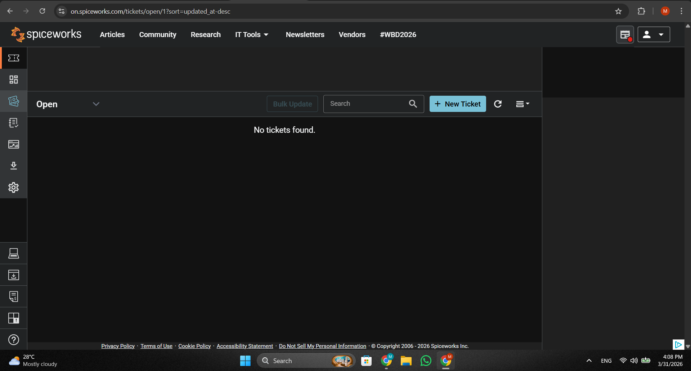
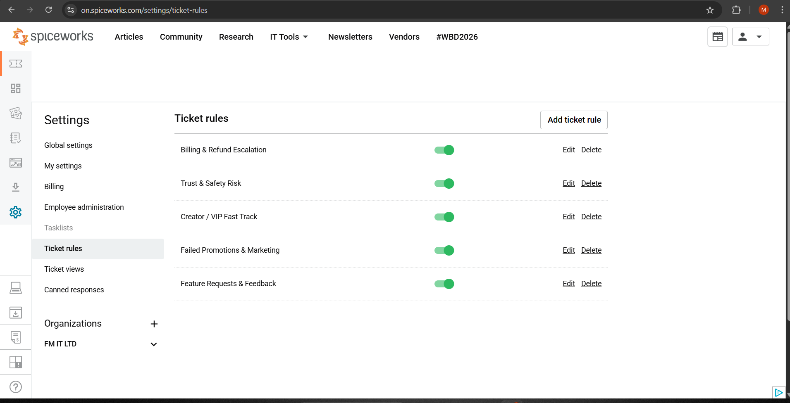
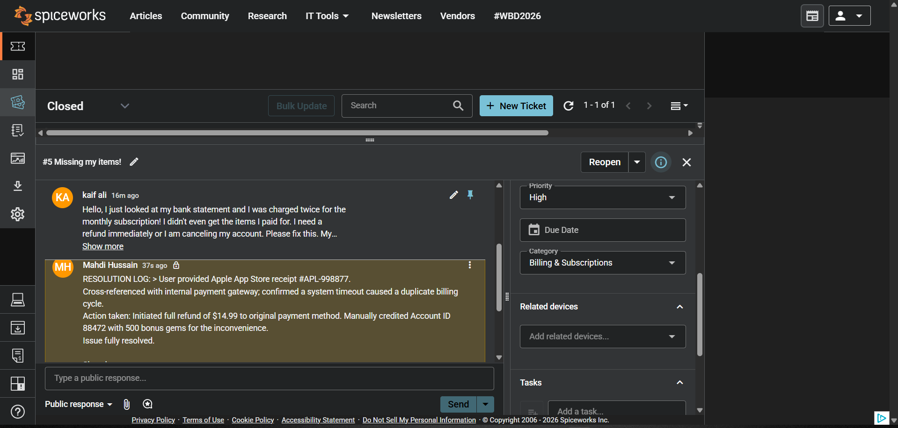
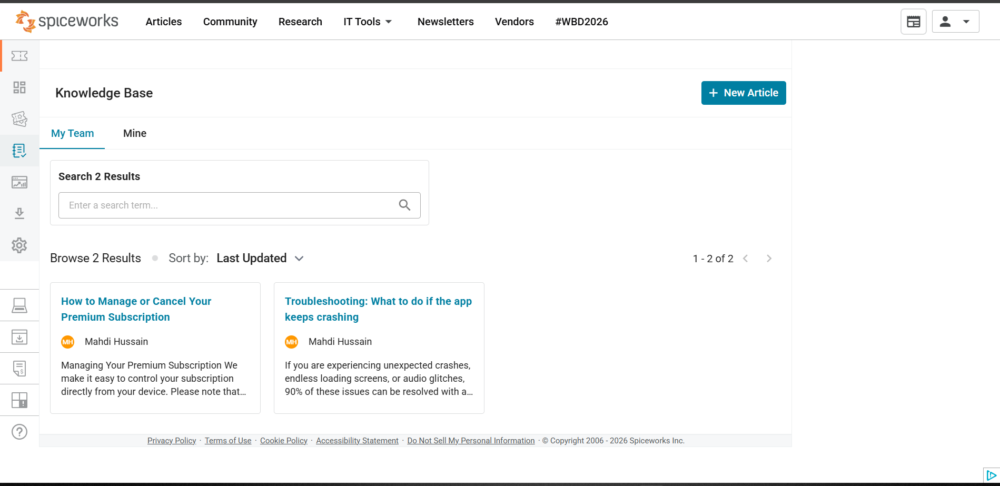

# B2C SaaS Helpdesk & Ticket Automation Simulation

**Objective:** Designed and configured a comprehensive cloud-based Helpdesk environment (Spiceworks) tailored for a high-volume B2C (Business-to-Consumer) mobile application. This project demonstrates proficiency in ticket triage, SLA automation, customer communication, and self-service knowledge base development.

**Platform & Methodologies:** * Spiceworks Cloud Help Desk  
* Incident Management & Ticket Triage  
* SLA (Service Level Agreement) Enforcement  
* B2C Customer Support Operations  

---

## Phase 1: Environment Setup & Customization
Replaced standard internal ITIL categories with external, app-specific categories to route user issues accurately to the correct support tiers. Implemented mandatory custom fields to capture critical diagnostic data upfront.

* **Custom Categories:** Billing & Subscriptions, Account Access & Security, Trust & Safety, App Performance & Bug Reports.
* **Custom Fields:** User Account ID, Device OS.

*(Note: Upload your custom categories screenshot here)*

---

## Phase 2: Workflow Automation & SLA Routing
Engineered a 4-tier automated triage system utilizing Boolean logic to instantly categorize incoming tickets based on keywords, domains, and sentiment risk. This reduces manual sorting time and enforces strict SLAs for financial and legal escalations.

**Key Automation Rules Configured:**
1. **Billing Escalation:** Instantly routes financial keywords (refund, charged twice) to High Priority.
2. **Trust & Safety Risk:** Flags severe compliance or legal threats as Critical.
3. **Bug Auto-Triage:** Aggregates technical complaints into a designated developer queue.
4. **VIP Fast-Track:** Recognizes premium user domains to guarantee expedited resolution.

  
*(See `docs/ticket-rules-logic.md` for full Boolean logic breakdowns)*

---

## Phase 3: Ticket Lifecycle & Customer Communication
Simulated incoming B2C ticket volume. The automation engine successfully caught trigger keywords, overriding default settings to correctly categorize and prioritize 100% of the queue within seconds.

Demonstrated end-to-end incident management by resolving a high-priority financial escalation. 
* Utilized canned responses for rapid, empathetic external communication.
* Maintained strict internal auditing standards by logging diagnostic steps and backend resolution actions in private tech notes before closing the ticket.

  
*(See `docs/canned-responses.md` for the template library)*

---

## Phase 4: Self-Service & Ticket Deflection
Developed a customer-facing Self-Service Help Center within the User Portal. Authored targeted Knowledge Base (KB) articles addressing the most common tier-1 support drivers, demonstrating a proactive approach to ticket deflection and end-user education.

  
*(See `docs/knowledge-base.md` for full article text)*
